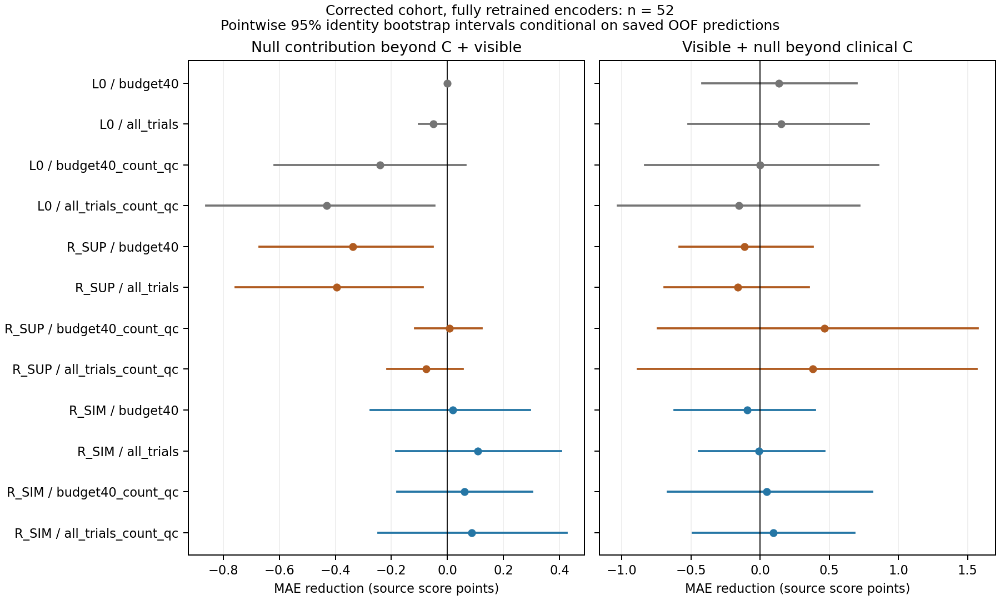
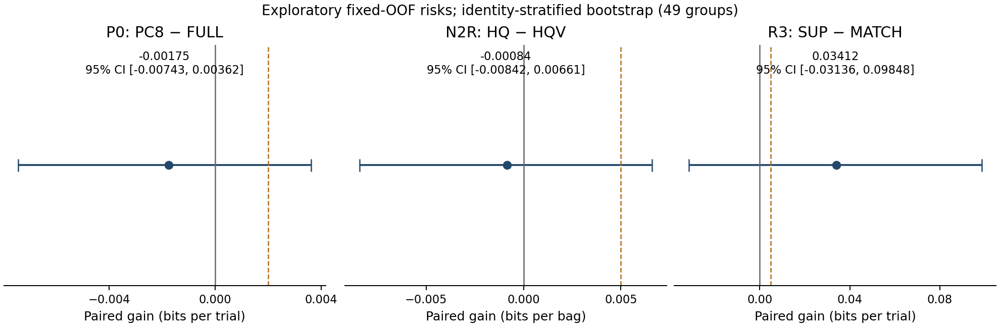
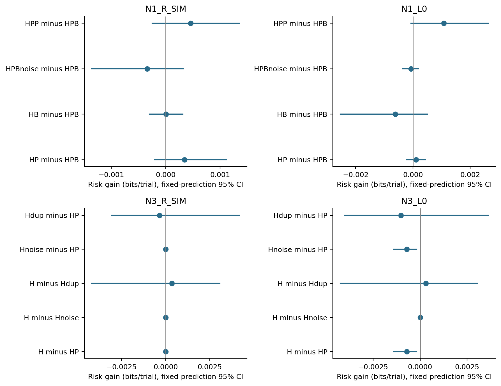
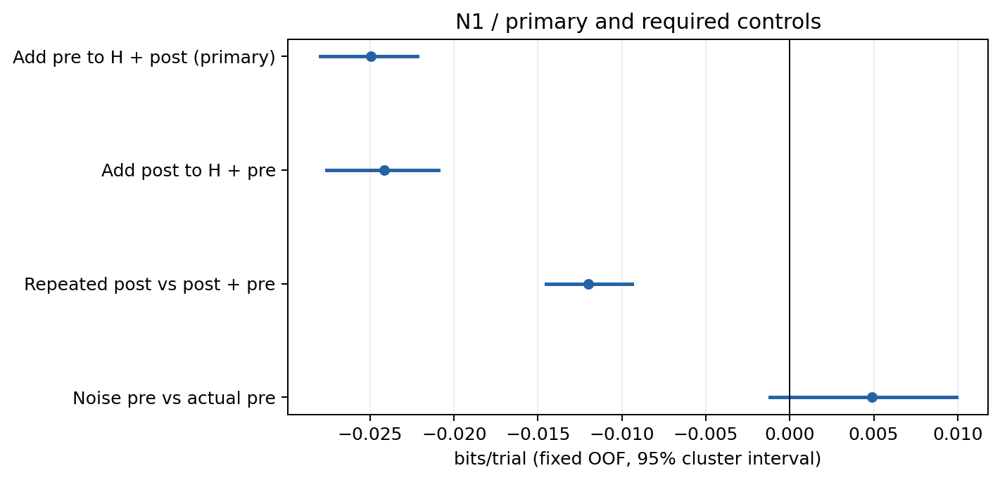

# 儿童听觉 EEG：数据审计与科学探索

本仓库保存面向 IEEE JBHI 同级期刊研究的 **Phase 0–3、Auditory5、v2/v2.1、V3、F1–F4 功能分析、PTA 修正与扩展分析，以及修正队列完整重训**的代码、方案、报告、汇总结果和图表。最新一轮已完成 40 个学习型编码器和 5 个 L0 表征任务，并通过独立执行核验；临床增益仍小且不确定，尚无独立临床验证或真实随访预测。原始 EEG、身份映射、逐人临床信息、逐 epoch 数据、个体预测和模型权重不在仓库中。

优先阅读[重训完整报告](reports/auditory_retrain_v1/verification_001/REPORT.md)、[结果解读](docs/auditory_retrain/INTERPRETATION.md)、[PTA 修正与扩展分析](reports/auditory_repair/verification_001/REPORT.md)和[最新状态](docs/auditory_retrain/STATUS.md)。**历史 PTA 勘误：旧 Phase 3 协变量使用了错误的临床行号映射，57 条比较中裸耳 PTA 有 55 条、助听 PTA 有 47 条变化。**旧 PTA 调整结果和 Auditory5 D 表只能作为历史记录；后续复用划分的间接影响也不能笼统排除。见[来源勘误](docs/auditory_fseries_archival/LEGACY_PTA_LINEAGE_AMENDMENT.md)与[修正复现说明](docs/auditory_repair/REPRODUCTION.md)。

从 [V3 完整结果](reports/auditory_v3/final_002/V3_RESULTS.md)、[科研判断](docs/auditory_v3/SCIENTIFIC_DECISION_001.md)和[最终状态](docs/AUDITORY_V3_FINAL_STATUS.md)开始阅读；前轮见 [v2.1 科学结果](docs/auditory_v21/SCIENTIFIC_RESULTS_v2_1.md)、[v2 报告](reports/auditory_next_v2/final_002/NEXT_ROUND_REPORT.md)和 [Auditory5 报告](reports/auditory5_v1/S4_final_001/FIVE_IDEAS_SCREENING_REPORT.md)。前期依据见 [Phase 3 报告](docs/phase3_report.md)与[原项目目标映射](docs/ORIGINAL_IDEA_EVIDENCE_MAP.md)。数据来源包含 HA、CI/CIHA 字面标签及大量组别未知记录；文件数、处理版本和 epoch 数不能当作独立儿童数。

## 最新：修正队列与新划分下完整重训

修正后的临床完整支持为 **52 个候选身份组**，外层总体为 60 组，其中 37 组外折分配变化。使用 5 外折 × 3 临床内折隔离，重新训练 20 个 R_SUP 和 20 个 R_SIM 编码器，并重新拟合 L0 的刺激头/投影；未沿用旧权重初始化。两条 GPU 作业均使用 L40S。三种表征的 81 个核心模型配置、99 个敏感性配置、121 项对照状态和 60 项 FP32 检查均完成；Slurm 999581 完成独立核验，汇总没有重新拟合模型。

C 为临床基线，V 为刺激可见分量，N 为刺激头 null 空间分量；正值表示 MAE 改善，单位为 MUSS 原表分值。

| 比较 | MAE 改善及 95% 固定 OOF 区间 | 解读 |
|---|---|---|
| 主分析 R_SIM：C+V → C+V+N | +0.0197 [−0.2742, +0.2953] | 小幅正点估计，增量尚不确定 |
| R_SIM：C → C+V+N | −0.0942 [−0.6183, +0.3978] | 联合模型未改善临床基线 |
| 平行 R_SUP：C → C+V | +0.2269 [−0.1046, +0.5951] | 保留可见分量的探索线索，区间跨零 |

SIM 的全试次和质量调整 null 增益约 +0.060 至 +0.109，区间均跨零；SUP 加入 PCA-null 后退步，随机方向对照不支持其特异优势。质量调整敏感性中的正增益也不能替代与原始临床基线的比较。完整小效应、对照和阴性结果均保留，没有以显著性或高增益阈值停止本轮。SUP 仍按原有训练内刺激目标监测选 epoch，SIM 固定 100 epoch。

这是 seed 11、已探索数据上的内部检验。区间条件于保存的 OOF 预测，没有覆盖完整重训/重划分不确定性或作多重比较调整；“独立执行核验”不是独立临床队列验证。候选身份、量表版本/时间、PTA 单位和设备状态仍有未解限制。新旧共同 49 组的描述比较同时改变队列、划分和拟合流程，不能归因为“增加一人”。

## F1–F4、PTA 修正与 CI/MFF 扩展

[严格临床资格审计](reports/auditory_fseries/STAGE1_QUALIFICATION_REPORT.md)补回量表说明，但未确认逐行版本和 EEG—量表时间关系。随后完成明确降低解释范围的[56 组档案初筛](reports/auditory_fseries_archival/verification_003/REPORT.md)，以及[57 组扩展分析和历史修正](reports/auditory_repair/verification_001/REPORT.md)：五类固定 EEG 特征、五个目标、质量/幅值分解、有限核方法、同 43 组试次数可靠性，以及旧 Phase 3 50 组和 Auditory5 D 51 组原折重算。V 条件于 A 的小幅正线索保留，但依赖对照设定，尚非临床有效性证据。

CI/MFF 已完成来源范围、DOB/年龄核对及混合来源档案回归。A/V 各 38 组，CAP/SIR 各 36 组；每个目标只有 1 组来自明确 CI 字面来源，不能将其写成 CI 独立验证。四项主要 EEG 增益均为小幅负值。F3 有 9 对同日跨任务记录、仅 2 对有临床数值交集；F4 的 HA 重复 EEG 与两组 MFF 多日期量表线索尚不足以建立真实临床随访预测。

## 历史 V3：三个独立能力门控实验

冻结匹配数据包含 **49 个身份组、698 个 bag、5,584 个唯一成员 trial**。P0、N2R、R3 的支持检查和能力测试均通过，真实比较完成；三项主分析均未建立预设方法优势。

| 实验 | 主增益及 95% 区间 | 科学判断 |
|---|---|---|
| P0：完整 SIM 表征对比 PCA8 | −0.001750 [−0.007433, 0.003619] bits/trial | 未检出明确的压缩损失；不能证明等价 |
| N2R：控制历史与二次均值后加入方差 | −0.000844 [−0.008417, 0.006606] bits/bag | 未建立受控额外收益 |
| R3：MATCH 对比监督学习 | +0.034125 [−0.031363, 0.098477] bits/trial | 未建立超出监督学习的优势 |

P0 完成 260 个、N2R 完成 550 个真实读出头；R3 完成 15 个选择阶段和 15 个最终编码器，以及 180 个选择读出头和 60 个最终读出头。R3 的 SUP/MATCH 判别接近随机且 CE 约 2.7，表现差于 SIM、历史和随机编码器基线；主区间跨零，正点估计不足以支持目标函数优势。原因尚未由额外实验确定。

区间来自固定 OOF 预测的身份组 bootstrap，没有重训完整流程；这些身份组不是已确认的独立儿童。匹配 bag 使用已知类别离线构造，不能当作在线未知刺激部署。本轮仅覆盖冻结 P_MATCH，不能推广至全部 CI 数据或临床预测。已探索队列、阴性结论和敏感性分析的地位保持不变。

数值修复保留完整记录：CUDA 首次反向的确定性错误通过等价无参数池化及同初始化恢复处理；有限 logit 的概率舍入问题通过稳定 logaddexp 重新评分处理，没有额外拟合或丢弃惩罚候选。总计 2,357/3,000 次头优化尝试、30/30 个正式编码器、3/3 个合成初始分配及 3 次同状态恢复。科研资源保守上界为 45.776 CPU core·h / 8.308 GPU·h，全部数值工作经 Slurm，GPU 为 A100。发布核验另计且不训练模型。

## v2.1：能力门控后的真实比较

新有限预算读出器先完成独立能力评估 **880/880 世界**，N1/N3 × R_SIM/L0 四条路线均通过冻结门槛，再完成全部 20 个真实外折、130 个 EEG 读出头。它保留基线候选，不是旧 MLP 求解器修复；强合成信号通过也不保证微小效应可检出。真实结果均为 `NO_CONTROLLED_INCREMENT_ESTABLISHED`。

| 比较 | 风险增益及 95% 区间（bits/trial） | 解释 |
|---|---|---|
| N1 R_SIM：HP → HPB | 0.000348 [−0.000200, 0.001120] | 59 身份组；反方向及噪声/复制对照也未建立受控增益 |
| N1 L0：HP → HPB | 0.000114 [−0.000225, 0.000432] | 次要表征，控制比较区间跨零 |
| N3 R_SIM：H → HP | 0 [0, 0] | 60 身份组；五折均选择历史基线，不能推断总体条件信息为零 |
| N3 L0：H → HP | −0.000710 [−0.001386, −0.000181] | 测试风险小幅退步，不是负互信息 |

A2 四个配对 SUP−SIM / SUP−RAND 比较区间均跨零。N2 旧袋的无 EEG 历史基线 bAcc 约 0.985；新匹配袋在 49/57 候选中有双半份共同支持，但固定角色分割的 4/5 外折组数不足，**按计划停止 N2 后续分布能力与真实比较**，不能写成分布信息不存在。来源收尾审计保留 4 项未解决控制/隔离限制。

所有区间均为固定预测/统计的身份组 bootstrap，未重训完整流程；身份组不是已经确认的独立儿童。当前真实比较属于 HA/BDF 工作包，不能推广为 CI 整体结论。科学验收 `final_001` 无必需回执缺失或失败，59 项模块测试通过；0 新编码器、0 GPU，科研申请资源上界 32 CPU core·h。发布检查另计，原结果与失败版本保留。

## auditory_next v2 结果

本轮复用既有表示，没有训练新编码器；按固定主比较探索背景条件读出、重复试次分布和序列先验之外的 EEG 增量，并修复旧读出。下表是探索结果，完整科学状态还取决于必要对照；数值未完成不能当作阴性。

| 问题 | 固定主结果及95%区间 | 决策与限制 |
| --- | --- | --- |
| A2：刺激差异重复性 | 49组，T=0.01539 [−0.03060, 0.05932] | 未达推进条件；背景预测项可重复，残差不能替代主终点 |
| C2-R：左右联合收益 | 60组，−0.000334 [−0.001047, 0.000301] bits/trial | 560个神经头与325个线性头完成；未显示明确联合收益，平行修复及部分隔离对照缺失 |
| N1：背景条件读出 | 59组，−0.024957 [−0.027989, −0.022169] bits/trial | 当前实现不推进；关键合成正对照仍不可评价 |
| N2：均值之外的方差增益 | k=8、57组，−0.001494 [−0.003017, −0.000258] bits/bag | 主线性结果为负；次要240个神经头失败，无EEG历史基线已达bAcc=0.98288 |
| N3：序列先验之外的EEG增量 | 60组，−0.050632 [−0.057756, −0.041194] bits/trial | 未达推进条件；训练选族和容量不同，负风险增益不等于负互信息 |
| E0-R：记录内目标可读性 | 1,024个神经头中765稳定、259未解决 | 全族新MLP结果扣留；旧7对linear结果单列，混合MFF来源不能整体称为CI |

C2-S几何重建精确，但两个新增空间成分没有共同显示明确预测收益。G0同记录后块R_SIM bAcc约0.516。合成审计发现共享背景预测可能制造残差重复性；另有90个分类世界因数值门限不可评价，未知分母保留。N1/N2/N3未触发seed23扩展或新架构开发。详见[路线四轴状态](results/auditory_next_v2/final_002/route_status.csv)。

最终版本为 **final_002**，历史文件与私有权限复核通过，45个最终交付文件通过结构/已知标识符扫描。`final_001`的旧完成标记未拦截日志权限异常，不能作为最终验收；修订记录保留。历史资源实际总量未知，保守上界138.773 CPU core·h / 13.713 GPU·h低于本轮上限。发布打包与测试另记在[发布核验](release/verification.json)，不改写科研预算回执。

## Auditory5 五路线首轮结果

以下为原始历史结果；D 路线 PTA 调整已发现来源错误。当前证据应同时查阅上方修正重算和完整重训报告，旧数值不作为修正后的结论。

90/90 表征任务完成（60 个学习型编码器、30 个 L0/随机任务）；173 项模块测试通过，完成 1,000 组合成实验。最终执行状态为 `S4_RECORDED_WITH_FAILURES`，不等于五条科学路线全部成功。主表征固定为 SimCLR（R_SIM），监督模型为平行分析。

| 路线 | 主结果及 95% 区间 | 状态 |
|---|---|---|
| A：刺激差分重复性 | N=55；T=0.01335 [−0.02700, 0.05356] | 效应较弱；0/55 满足全部固定历史×位置配额，关键对照支持不足 |
| B：条件历史信息 | N=60；增益 −0.00217 [−0.00309, −0.00122] bits/trial | 控制完成；`NEGATIVE_SCREEN` |
| C：左右证据互补 | 主 MLP32 读出未完成；线性结果完整保留 | 数值不收敛，`IMPLEMENTATION_FAIL`；不能解释为科学阴性 |
| D：刺激头 null 空间的临床增益 | N=51；MAE 改善 0.10873 [−0.14220, 0.38796] MUSS 源分 | 控制完成；未达到 0.5 分探索阈值，`NEGATIVE_SCREEN` |
| E：跨任务充分性 | E0 线性结果有 7 对；5 个 MLP 记录×读出失败；E1 bapa 16<20 | E0 部分数值失败；E1 群体迁移支持不足 |

区间来自固定 OOF 结果的 2,000 次候选级 bootstrap，没有重训完整流程。不同路线单位不同；上述量级阈值是探索筛选规则，不是临床有效性阈值。已探索队列不作为未经查看的确认样本。

## Phase 0–3 已有结果

下表保留原发布数值，其中 PTA 调整的 HA 临床模型须以新修正报告共同解释。

| 问题 | 实验结果 | 解释范围 |
|---|---|---|
| 试次数量与幅值一致性 | 同一 49 个 HA 候选，每半份 20→160 个试次，ICC 中位数 0.394→0.809 | 完整采集内回顾性抽样；不是跨日重测或已验证的提前停止规则 |
| EEG 是否改善 MUSS 预测 | 同一 50 个 HA 候选，临床基线 MAE 7.048；加入分别惩罚的 EEG 时空特征为 7.075 | 测试的特征和模型未显示临床增量；惩罚敏感性检查是在看到初始结果后追加 |
| CI/MFF 事件响应 | 203 份 canonical MFF，164,735 个目标事件，145,180 个主 QC 保留试次；明确 CI、任务未知的 18 份完整支持记录，刺激后 AUC 中位数 0.517 | 记录内事件码解码较弱；203 份记录不是 203 名 CI 儿童 |
| CI 临床建模支持 | 来源 CI/CIHA 标签或同日明确 CI 设备史共 17 个候选索引，年龄/MUSS/可测 EEG 交集为 2 | 37 个混合来源完整候选不能直接视为确认 CI 样本；量表单位仍有问题 |

最后的元数据补充识别了部分设备佩戴说明，以及 6 份 `normal` 字面标签来源，留下 155 份未知组别来源。`normal` 不等同于临床确认正常听力，佩戴说明也不确证设备开启或逐 epoch 条件。初始实验分层及后续修正均保留。

## 阅读与复现入口

- 最新完整重训：[冻结方案](docs/auditory_retrain/PROTOCOL_v1.md)、[状态](docs/auditory_retrain/STATUS.md)、[解读](docs/auditory_retrain/INTERPRETATION.md)、[复现导航](docs/auditory_retrain/REPRODUCTION.md)、[全部模型指标](results/auditory_retrain_v1/verification_001/model_metrics.csv)、[全部比较](results/auditory_retrain_v1/verification_001/contrasts.csv)。
- 功能与修正：[F1–F4 方案](AUDITORY_FUNCTIONAL_DECODING_F1_F4_RESEARCH_PLAN_v1.md)、[资格审计](reports/auditory_fseries/STAGE1_QUALIFICATION_REPORT.md)、[档案初筛](reports/auditory_fseries_archival/verification_003/REPORT.md)、[扩展与修正方案](docs/auditory_repair/PROTOCOL_v2.md)、[扩展最终报告](reports/auditory_repair/verification_001/REPORT.md)、[复现导航](docs/auditory_repair/REPRODUCTION.md)。
- V3：[执行方案](AUDITORY_V3_DESIGN_AND_EXECUTION_PLAN_eb24106.md)、[机器配置](auditory_v3_plan.yaml)、[最终报告](reports/auditory_v3/final_002/V3_RESULTS.md)、[科研判断](docs/auditory_v3/SCIENTIFIC_DECISION_001.md)、[复现导航](docs/auditory_v3/REPRODUCTION.md)、[执行修订](docs/auditory_v3/EXECUTION_DECISIONS.md)、[作业记录](docs/auditory_v3/JOB_LEDGER.md)、[完整主效应表](results/auditory_v3/final_002/primary_results.csv)。
- v2.1：[审阅修订方案](AUDITORY_V2_1_REVIEW_AMENDMENT_79b3521%20%281%29.md)、[科学结果](docs/auditory_v21/SCIENTIFIC_RESULTS_v2_1.md)、[复现导航](docs/auditory_v21/REPRODUCTION.md)、[作业记录](docs/auditory_v21/JOB_LEDGER.md)、[路线状态](results/auditory_v21/final_001/four_axis_routes.csv)、[PDF/PNG 图表](reports/auditory_v21/figures_002/)。
- auditory_next v2：[执行方案](AUDITORY_NEXT_ROUND_SERVER_PLAN_v2.md)、[最终报告](reports/auditory_next_v2/final_002/NEXT_ROUND_REPORT.md)、[研究决策](docs/AUDITORY_NEXT_RESEARCH_DECISIONS_v2.md)、[复现导航](docs/AUDITORY_NEXT_REPRODUCTION_v2.md)、[聚合指标](results/auditory_next_v2/final_002/metrics_aggregate.csv)、[GPU规则](docs/GPU_SCHEDULING_POLICY.md)。
- Auditory5：[执行方案](AUDITORY_FIVE_IDEAS_SERVER_PLAN_v1.md)、[最终报告](reports/auditory5_v1/S4_final_001/FIVE_IDEAS_SCREENING_REPORT.md)、[作业记录](docs/AUDITORY5_JOB_LEDGER.md)、[复跑导航](docs/AUDITORY5_REPRODUCTION_v1.md)、[聚合指标](results/auditory5_v1/S4_final_001/metrics_aggregate.csv)。
- Phase 3：[报告](docs/phase3_report.md)、[科学方案](docs/PHASE3_SCIENTIFIC_PROTOCOL.md)、[产物导航](docs/PHASE3_ARTIFACTS.md)。
- Phase 2：[报告](docs/phase2_report.md)、[固定方案](docs/PHASE2_PROTOCOL.md)、[产物导航](docs/PHASE2_ARTIFACTS.md)。
- Phase 1：[报告](docs/phase1_report.md)、[固定测量方案](docs/PHASE1_MEASUREMENT_PROTOCOL.md)、[产物导航](docs/PHASE1_ARTIFACTS.md)。
- Phase 0：[数据审计](docs/phase0_report.md)、[产物导航](docs/ARTIFACTS.md)、[项目规划](docs/PROJECT_PLAN.md)。
- [发布范围与复现说明](PUBLICATION.md)、[汇总文件导航](results/README.md)、[发布文件清单与 SHA256](release/manifest.json)。

`auditory_v3/`、`auditory_v21/`、`auditory_next/`、`auditory5/`、`scripts/`、`configs/`、`slurm/` 保存分析代码、配置和批任务入口；`server_restart_en_v1/` 是早期历史计划，不代表最新证据。所有分析和验证均通过 Slurm 运行；后续GPU禁用P100，优先A100/L40S/H100，备选V100/PRO6000。完整数据流程依赖服务器上的受限源数据、映射及分运行源码快照，单独克隆此仓库不能重建全部实验。
