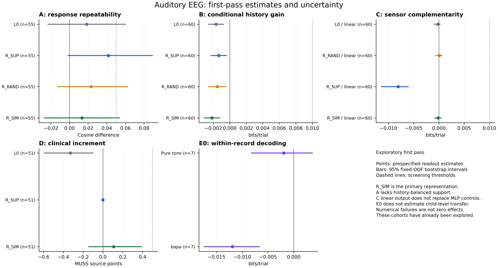
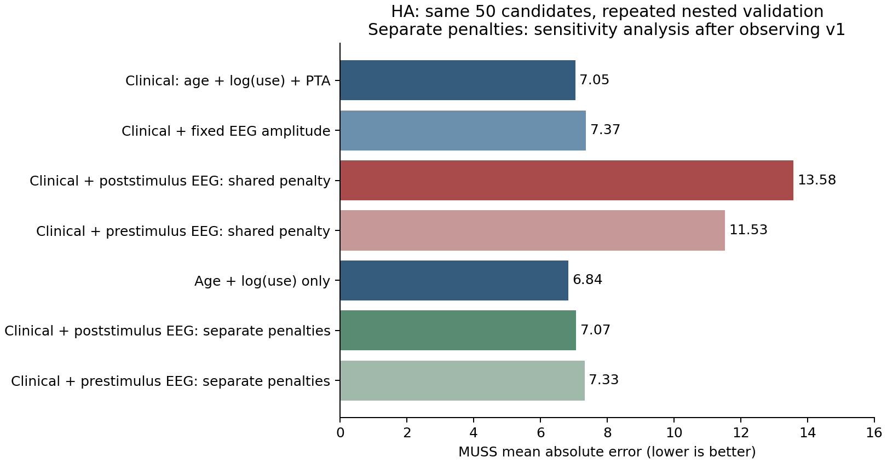
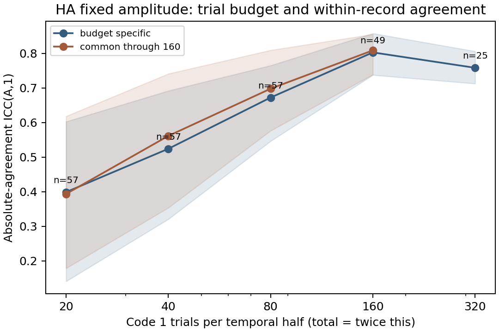

# 儿童听觉 EEG：数据审计与科学探索

本仓库保存面向 IEEE JBHI 同级期刊研究的 **Phase 0–3 与 Auditory5 五路线代码、方案、报告、汇总结果和图表**。Auditory5 首轮执行已结束，保留阴性、支持不足和数值失败；尚未形成可投稿论文或经验证的临床模型。原始 EEG、身份映射、逐人临床信息、逐 epoch 数据、个体预测和模型权重不在仓库中。

从 [Auditory5 最终筛查报告](reports/auditory5_v1/S4_final_001/FIVE_IDEAS_SCREENING_REPORT.md) 和 [首轮状态说明](docs/AUDITORY5_FINAL_STATUS_v1.md) 开始阅读；前期依据见 [Phase 3 科学探索报告](docs/phase3_report.md) 与 [原项目目标—实验依据映射](docs/ORIGINAL_IDEA_EVIDENCE_MAP.md)。数据来源包含 HA、CI/CIHA 字面标签及大量组别未知记录；文件数、处理版本和 epoch 数不能当作独立儿童数。

## Auditory5 五路线首轮结果

90/90 表征任务完成（60 个学习型编码器、30 个 L0/随机任务）；173 项模块测试通过，完成 1,000 组合成实验。最终执行状态为 `S4_RECORDED_WITH_FAILURES`，不等于五条科学路线全部成功。主表征固定为 SimCLR（R_SIM），监督模型为平行分析。

| 路线 | 主结果及 95% 区间 | 状态 |
|---|---|---|
| A：刺激差分重复性 | N=55；T=0.01335 [−0.02700, 0.05356] | 效应较弱；0/55 满足全部固定历史×位置配额，关键对照支持不足 |
| B：条件历史信息 | N=60；增益 −0.00217 [−0.00309, −0.00122] bits/trial | 控制完成；`NEGATIVE_SCREEN` |
| C：左右证据互补 | 主 MLP32 读出未完成；线性结果完整保留 | 数值不收敛，`IMPLEMENTATION_FAIL`；不能解释为科学阴性 |
| D：刺激头 null 空间的临床增益 | N=51；MAE 改善 0.10873 [−0.14220, 0.38796] MUSS 源分 | 控制完成；未达到 0.5 分探索阈值，`NEGATIVE_SCREEN` |
| E：跨任务充分性 | E0 线性结果有 7 对；5 个 MLP 记录×读出失败；E1 bapa 16<20 | E0 部分数值失败；E1 群体迁移支持不足 |

区间来自固定 OOF 结果的 2,000 次候选级 bootstrap，没有重训完整流程。不同路线单位不同；上述量级阈值是探索筛选规则，不是临床有效性阈值。已探索队列不作为未经查看的确认样本。

## Phase 0–3 已有结果

| 问题 | 实验结果 | 解释范围 |
|---|---|---|
| 试次数量与幅值一致性 | 同一 49 个 HA 候选，每半份 20→160 个试次，ICC 中位数 0.394→0.809 | 完整采集内回顾性抽样；不是跨日重测或已验证的提前停止规则 |
| EEG 是否改善 MUSS 预测 | 同一 50 个 HA 候选，临床基线 MAE 7.048；加入分别惩罚的 EEG 时空特征为 7.075 | 测试的特征和模型未显示临床增量；惩罚敏感性检查是在看到初始结果后追加 |
| CI/MFF 事件响应 | 203 份 canonical MFF，164,735 个目标事件，145,180 个主 QC 保留试次；明确 CI、任务未知的 18 份完整支持记录，刺激后 AUC 中位数 0.517 | 记录内事件码解码较弱；203 份记录不是 203 名 CI 儿童 |
| CI 临床建模支持 | 来源 CI/CIHA 标签或同日明确 CI 设备史共 17 个候选索引，年龄/MUSS/可测 EEG 交集为 2 | 37 个混合来源完整候选不能直接视为确认 CI 样本；量表单位仍有问题 |

最后的元数据补充识别了部分设备佩戴说明，以及 6 份 `normal` 字面标签来源，留下 155 份未知组别来源。`normal` 不等同于临床确认正常听力，佩戴说明也不确证设备开启或逐 epoch 条件。初始实验分层及后续修正均保留。

## 阅读与复现入口

- Auditory5：[执行方案](AUDITORY_FIVE_IDEAS_SERVER_PLAN_v1.md)、[最终报告](reports/auditory5_v1/S4_final_001/FIVE_IDEAS_SCREENING_REPORT.md)、[作业记录](docs/AUDITORY5_JOB_LEDGER.md)、[复跑导航](docs/AUDITORY5_REPRODUCTION_v1.md)、[聚合指标](results/auditory5_v1/S4_final_001/metrics_aggregate.csv)。
- Phase 3：[报告](docs/phase3_report.md)、[科学方案](docs/PHASE3_SCIENTIFIC_PROTOCOL.md)、[产物导航](docs/PHASE3_ARTIFACTS.md)。
- Phase 2：[报告](docs/phase2_report.md)、[固定方案](docs/PHASE2_PROTOCOL.md)、[产物导航](docs/PHASE2_ARTIFACTS.md)。
- Phase 1：[报告](docs/phase1_report.md)、[固定测量方案](docs/PHASE1_MEASUREMENT_PROTOCOL.md)、[产物导航](docs/PHASE1_ARTIFACTS.md)。
- Phase 0：[数据审计](docs/phase0_report.md)、[产物导航](docs/ARTIFACTS.md)、[项目规划](docs/PROJECT_PLAN.md)。
- [发布范围与复现说明](PUBLICATION.md)、[汇总文件导航](results/README.md)、[发布文件清单与 SHA256](release/manifest.json)。

`auditory5/`、`scripts/`、`configs/`、`slurm/` 保存实际分析代码、配置和批任务入口；`server_restart_en_v1/` 是早期历史计划，不代表最新证据。所有分析和验证均通过 Slurm 运行；Auditory5 已完成小型监督 CNN 和 SimCLR 的 GPU 训练。完整数据流程依赖服务器上的受限源数据及映射文件，单独克隆此仓库不能重建全部实验。
