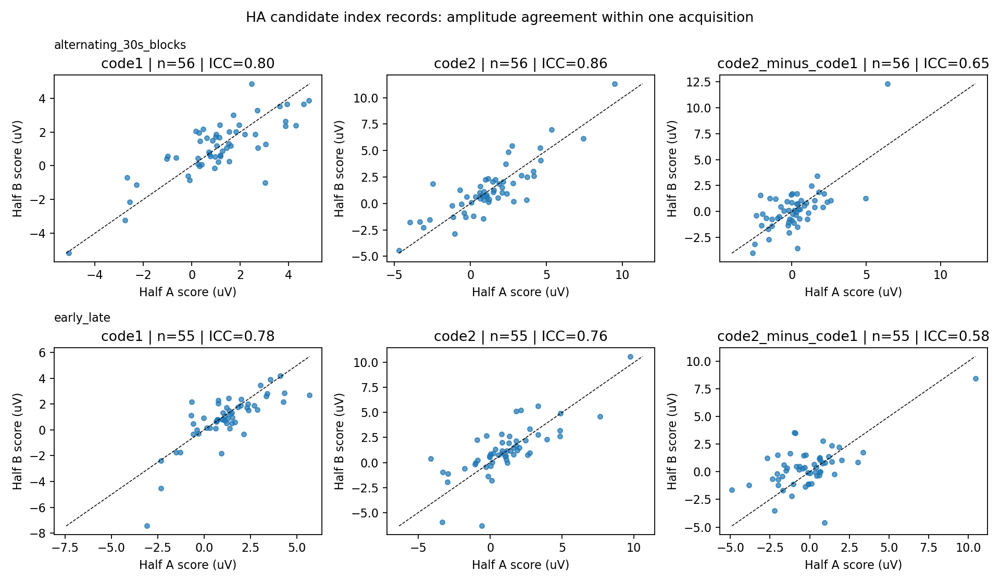
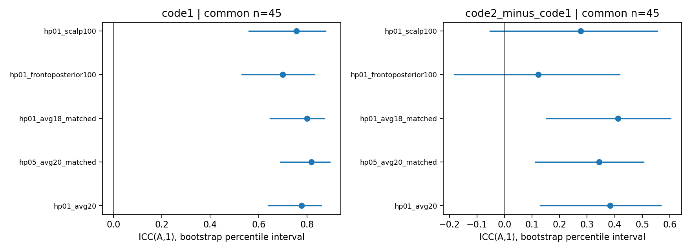
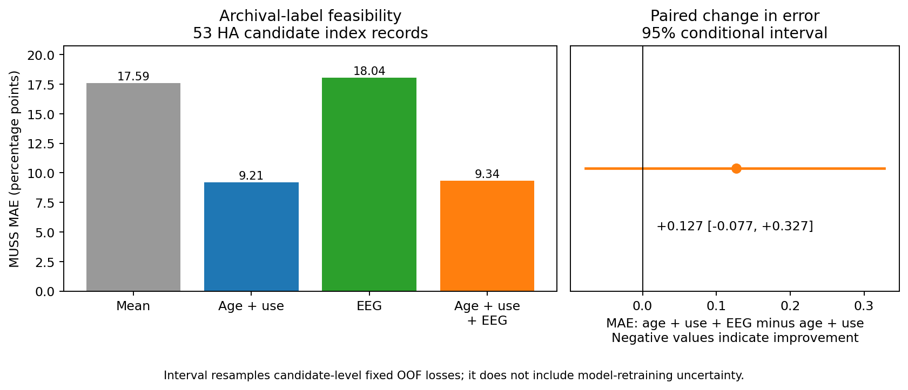

> GitHub 发布副本：仅提供代码、报告、汇总结果和选定图表。逐人、逐记录、逐 epoch 及原始来源资料仍保存在服务器；原文的服务器内保存声明描述审计时状态。发布范围见 [PUBLICATION.md](../PUBLICATION.md)。

# Phase 2：个体幅值稳定性与第一次固定临床档案实验

2026-09-16。**code 1 固定窗幅值在同一次采集内有一定个体间一致性，但这个单一 EEG 指标尚未显示对 MUSS 的增量预测价值。** 更严格地删试次也没有在共同候选人中稳定改善幅值一致性。当前结果支持继续研究测量和信号信息，但不支持直接包装为已验证的临床 EEG 标志物。

本轮实际完成 84 条记录的全部 **80,441 个存储 epochs** 再检查、逐 epoch 额枕瞬变代理与敏感性保留账本、候选人层半份幅值一致性、参考/阈值敏感性、较长时间块不确定性，以及 53 个 HA 候选的固定档案标签实验。方法在运行前写入 [Phase 2 方案](PHASE2_PROTOCOL.md)和 [phase2_v1.json](../configs/phase2_v1.json)；原始数据和 Phase 1 v1 均保留。

## 1. 从记录数到候选人索引

每个姓名候选簇按 vendor 实际采集日期和起始时间选最早记录，同时间用不透明记录 ID 决胜。时间字段独立于文件修改时间、EEG 质量及量表结果。全部 93 条记录的采集日期和 DOB 均可解析。DOB 冲突、最早来源不合格或试次不足时不改选下一次记录。

| 逐步门槛 | HA | NH |
|---|---:|---:|
| 原始 BDF 来源记录 | 84 | 9 |
| 姓名候选簇，各锁定最早记录 | 69 | 9 |
| 无 DOB 冲突且最早记录通过来源门槛 | 61 | 9 |
| 主方案每码≥40 次、每码≥8 个时间块 | 57 | 9 |
| 主方案交替半份各码≥20 次 | 56 | 9 |
| 主方案前后半份各码≥20 次 | 55 | 9 |

HA 从 69 到 61：两个候选簇有 DOB 冲突，六个其他候选的最早记录来源被隔离；另有 15 条后续记录只保留作记录级检查。61 个 HA 索引中四个未通过完整测量门槛。所有计数仍是**候选身份簇**，不是已彻底确证的独立儿童；没有用 GUID 数或 epoch 数代替人数。

临床档案要求在上述最早来源合格记录上有唯一“姓名＋标签日期”链接。57 个 HA 候选满足且年龄、使用时长、MUSS 完整，其中四个 EEG 试次不足，最终进入档案实验 **53 个**。量表日期是否为 EEG 日期、设备采集时是否开启仍未知，没有由模型补齐。

## 2. 这次检验的是幅值，不再只是波形形状

固定指标为 Fz/Cz 的 50–250 ms 均值，主终点 code 1，code 2 和 code 2−code 1 为次要。下表为 HA 候选人之间两半幅值的绝对一致单次测量 ICC(A,1)，括号为候选人配对 bootstrap 的 95% 百分位区间；每项 2,000 次均有效。各行使用同一批完整支持候选人。

| 条件 | 交替 30 s 块，n=56 | 前半/后半，n=55 |
|---|---:|---:|
| code 1 | 0.801（0.604–0.896） | 0.776（0.654–0.852） |
| code 2 | 0.855（0.714–0.919） | 0.761（0.585–0.868） |
| code 2−code 1 | 0.654（0.358–0.764） | 0.580（0.117–0.796） |

code 1 前后半均值偏差为后半减前半 **−0.313 μV**，描述性一致性界限约 **−2.651 至 +2.025 μV**。相关或 ICC 并不意味着两半差异可忽略，也不证明信号的神经来源。所有半份来自同次采集，滤波和慢变状态仍可造成依赖，不能称为跨日重测信度。

按每个候选、每个代码将两半试次数降至较小者，固定种子各抽一次后，code 1 的 ICC 为交替 **0.789**、前后 **0.772**；差值则为 **0.442** 和 **0.430**。该敏感性同时改变试次数和具体试次，不将单次抽样差异归因为某一个因素，也不声称等量化一定更好。

查看散点图后，追加了明确标为事后的逐候选留一影响诊断，未删任何候选、未改主分析。前后半 code 1 的 ICC 在逐个暂去一个候选时为 **0.760–0.796**；差值为 **0.312–0.632**，比主值 0.580 更受个别候选影响。差值的宽区间、抽样敏感性和影响诊断均不支持仅引用一个 ICC 点估计宣称可靠。

## 3. 参考变化和删试次的实际代价

0.5 Hz 高通、18 通道平均参考均使用与主方案完全相同的试次；18 通道参考只从平均参考集合中排除 Fp1/Fp2。额枕代理为 Fp1/Fp2 均值减 Oz/O1/O2 均值，计算保存的 250 Hz 全 epoch 峰峰值。额枕差≤100 μV 和原全头皮≤100 μV 为两种额外筛选。**额枕代理不是 EOG、眨眼确诊或设备伪迹检测**，其拒绝也可能影响真实信号；没有据此声称已完成全面伪迹校正。

在同一组 61 个 HA 索引上：

| 方案 | 完整可测候选 | 保留试次数，含不足整条测量门槛的记录 | 相对主方案额外拒绝 |
|---|---:|---:|---:|
| 主方案、0.5 Hz 同试次、18 通道同试次 | 各 57 | 各 40,545 | 0 |
| 额枕代理≤100 μV | 49 | 30,481 | 10,064 |
| 全头皮≤100 μV | 48 | 30,107 | 10,438 |

所有方案均支持前后半比较的共同集合为 **45 个 HA 候选**。在这同一集合中，code 1 的 ICC 分别为主方案 **0.778**、0.5 Hz **0.818**、18 通道参考 **0.800**、额枕筛选 **0.700**、全头皮严格筛选 **0.756**。这些是同人群的描述性比较，未对算法优劣作显著性或神经有效性结论。两个严格筛选版本试次不同，不把“共同候选人”写成“所有方案相同试次”。

在 57 个共同完整可测 HA 候选中，18 通道与主方案 code 1 全记录均值相关为 **0.993**，中位绝对变化 **0.149 μV**；0.5 Hz 对应为 **0.847**、**0.142 μV**。中位变化小仍可伴随个别明显变化，保留逐记录结果，不用相关替代绝对一致性。

30/60/90 s 联合块 bootstrap 的 code 1 标准误中位数为 **0.384/0.372/0.327 μV**；差值为 **0.809/0.865/0.768 μV**。块越长并不必然得到越大的估计，长块数量减少也影响估计；本次没有证据将某个长度认定为真实不确定性。逐记录块数和有效抽样数均保存。

## 4. 固定的 MUSS 档案标签实验：未见增量收益

在 **53 个 HA 候选最早记录**上，按预先固定方案比较四个模型：训练均值；年龄＋HA 使用月数；单一 code 1 幅值；年龄＋使用月数＋该幅值。岭回归 alpha=1、训练折内标准化、统一截断预测至 0–100%，20 次重复 5 折，每次四个模型使用完全相同的候选人划分。没有调参或 EEG 特征筛选，每个候选只有一个索引记录进入模型。重复和折数均不算新增样本。

| 模型 | MAE，MUSS 百分点 | RMSE，百分点 | R² |
|---|---:|---:|---:|
| 训练均值 | 17.594 | 20.408 | −0.047 |
| 年龄＋使用时长 | **9.214** | **12.212** | **0.625** |
| EEG 单变量 | 18.038 | 20.660 | −0.073 |
| 年龄＋使用时长＋EEG | 9.341 | 12.330 | 0.618 |

加入 EEG 后 MAE 变化为 **+0.127 百分点**，本次点估计略差。按候选人固定 OOF 损失 bootstrap 的 95% 区间为 **−0.077 至 +0.327**；该区间未重训全流程，只是条件于已拟合模型的损失区间，不是完整泛化区间或正式显著性检验。20 次相互依赖重复的变化范围为 −0.070 至 +0.312。**本次没有显示这个单一幅值指标带来稳定增量价值；不能据此断言全部 EEG 信息都无用。**

53 个候选中 **18 个 MUSS=100%**，存在明显天花板；MUSS 观察范围 20–100%。四个临床表年龄与 DOB/EEG 计算年龄差超过 3 个月，没有超过 12 个月的；没有按此事后排除，原始差异保存在 private。所有候选使用时长未超过临床表年龄。这里使用原表百分比列，量表版本和评估日期未确证。

这一实验只能表述为**候选档案标签上的探索性可行性结果**。基线仅覆盖年龄和使用时长，未纳入可靠的听力/可听度变量；身份、设备状态、同期性仍有限制。因此不能将较高的临床基线 R² 当作前瞻预测或临床效用证据，也不能把 EEG 的阴性增量结果升级为确定的生理结论。

## 5. 核验与当前研究决定

19 项读取器及数值测试通过，涵盖绝对一致与纯相关的区别、负 ICC、配对重采样、线性参考、半份平衡、训练内缩放和 vendor 日期解析。执行后独立核对 **80,441 行逐 epoch 账本、57,879 个原主方案保留试次、93 条来源、每人唯一索引、候选人折划分、四模型 MAE 及 28 个分析产物哈希**。本轮重算的主方案幅值与 Phase 1 最大差异约 1.8×10⁻¹⁵ μV。

所有运算、测试、绘图均经 CPU Slurm，未使用 GPU。主要测量作业约 23 s，模型约 3 s；申请每任务 1 CPU、3–4 GB，集群实际部分分配 2 CPU。accounting 服务仍不可用，不声称取得完整内存峰值或计费记录。图表检查发现首次模型图标题截断，已单独重绘 PNG/PDF，模型和统计结果未改。

下一步应围绕信息来源和可解释性继续：检查剩余设备/眼动等信号污染；以清晰的研究假设定义新的时间或空间指标；完善 CI 分支的采集去重、epoch 与临床行对应，判断其能否成为独立补充。任何扩展特征或模型都需要新版本，并说明本次结果已经被查看，不能反复在这 53 个候选上寻找漂亮结果后称为独立验证。现阶段尚不具备一篇完成的 JBHI 投稿论文，也没有充分理由直接堆复杂模型。

全部结果入口见 [Phase 2 产物导航](PHASE2_ARTIFACTS.md)。
